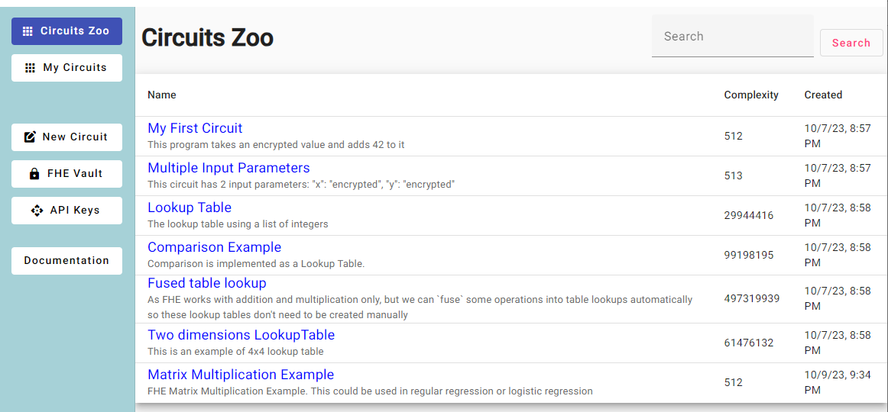
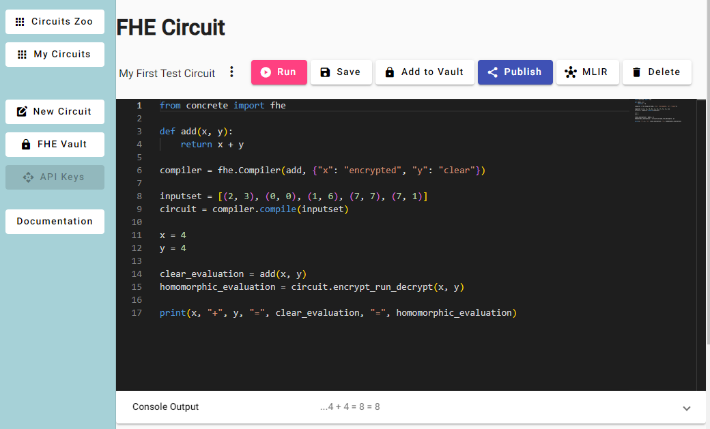
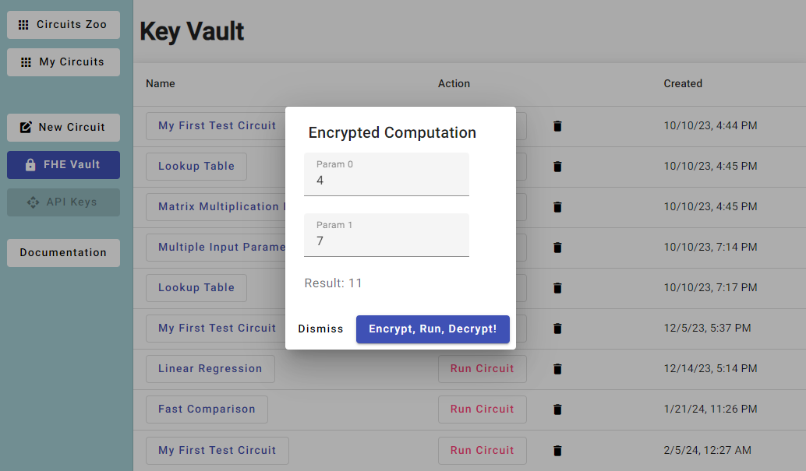

# Fully Homomorphic Encryption Studio

[FHE-Studio.com](https://fhe-studio.com) is an open source IDE for anyone who want to create programs that process encrypted data.

# What is Homomorphic Encryption

Homomorphic encryption is a cryptographic technique that allows you to perform operations on encrypted data without needing to decrypt it first. This is valuable in situations where privacy and security are paramount, such as in cloud computing or data outsourcing scenarios.

Imagine you have some sensitive data, like your salary, stored in an encrypted form. Traditional encryption would require you to decrypt it first to perform any calculations or operations. But with homomorphic encryption, you can perform mathematical operations on the encrypted data itself, and the result will also be encrypted.

For example, if your encrypted salary is represented as "X" and you want to calculate your taxes by multiplying it by a tax rate, you can do that without ever revealing the actual salary or tax rate. You'll get an encrypted result, let's call it "Y," which only you or authorized parties can decrypt to obtain the final tax amount.

So, in a nutshell, homomorphic encryption is like having a secure mathematical superpower that lets you manipulate encrypted data without exposing the sensitive information it contains. It's an essential tool for protecting data privacy in various applications, including secure computation and data analytics.

[More on FHE Business value](why-fhe.md)

# FHE Studio
The objective of this project is to create a user-friendly, open-source IDE specifically tailored for fully homomorphic encryption (FHE) development. FHE is a groundbreaking technology with immense potential to protect sensitive data while still allowing for computation on encrypted data. Existing encryption methods, like AES and RSA, protect data at rest and in transit, but the data must be decrypted for processing. This exposes it to potential breaches and insider threats during the processing stage. FHE stays always encrypted while processing, decrypting the final result(s) only.

FHE-Studio.com is a free open source IDE for anyone who wants to create programs that process encrypted data & AI models. FHE significantly simplifies the cyber security architecture. Unlike Zero Trust, which requires intricate security layers and policies, FHE integrates into public clouds with minimal disruption.

FHE is considered one of the most promising cryptographic technologies to address the security challenges posed by quantum computing, often referred to as the "post-quantum" era, which makes it a favourable cybersecurity choice for public data sharing (e.g. Blockchain)

However, it remains a complex and resource-intensive field. Therefore, an intuitive and accessible development environment is essential for advancing FHE applications and expanding its adoption.

# FHE program

## 1. Choose From A List of Available Circuits

## 2. Or Program a Circuit Yourself

## 3. Add a Program to Key Vault to Encrypt, Run, Decrypt!

# How to build FHE programs

[Open the development guide](how-to-build-fhe-circuits.md)

## Donation and Sponsorship
If you've found value in our project, [consider supporting us](https://github.com/sponsors/artifirm). We're committed to keeping FHE-Studio open and accessible, and every contribution helps us expand the project and keep it free. 
Etherium address for crypto contributions : 0x87e94591E62cFA14fAbdA3d8514dC2a507402E58 
![Etherium 0x87e94591E62cFA14fAbdA3d8514dC2a507402E58](data:image/png;base64,iVBORw0KGgoAAAANSUhEUgAAAK0AAACpCAYAAABZPr1VAAAAAXNSR0IArs4c6QAAAARnQU1BAACxjwv8YQUAAAAJcEhZcwAADsMAAA7DAcdvqGQAAASPSURBVHhe7dzBjts4EAXA8f7/PycZZAz4QK7cIlvQc6ouuwe5RbYeCLcn9uPXH18Q5L+f/0IMoSWO0BJn+J728Xj8/N/9dL0Fr+z56jFgtLbZGlavvYOj/jppiSO0xBFa4ggtcYSWOKVPD46mut0qk3BF2tR8ZR8SnrGTljhCSxyhJY7QEkdoibPl04PVabxSd8caZjXetbrfb6trmFnt2Y7+juxYw5OTljhCSxyhJY7QEuejB7HZtSOVPa/u99tq3creZlb7W1Gpe7Q3Jy1xhJY4QkscoSWO0BLnn/wz7sisbpczU/Oryn7v3N8zfXDSEkdoiSO0xBFa4nzMt3Erg8LV+3jX1Xs4MwTtdmYNTlriCC1xhJY4QkscoSVO6dODO5hNlpUp1LV/ja69g9l6n5y0xBFa4ggtcYSWOMNBLFFlALnSbNhZXVtX3QROWuIILXGEljhCSxyhJc4tvo1b0TUd32Eav3oNqc/NSUscoSWO0BJHaInTNohVrp1ZffO+Y7BZXe+O/VZqjFTq7ljDan+PXu+kJY7QEkdoiSO0xBFa4pT+EfhsghyV2DFtdk2sFWem21eVnu1wZc8q95o5swYnLXGEljhCSxyhJc7l38ZdHRR2vPkf2dGGriFoVHf19Z0qz+1M3520xBFa4ggtcYSWOEJLnC2fHnzC1Dyru1qjMjV39bGist6Zyj5Gju7lpCWO0BJHaIkjtMQpfRt3h9UBYsdgU1lD91Dx6s7rrdRdXe/R6520xBFa4ggtcYSWOEJLnLZPD1YnyJlZ3dUas9d37WOksrcd66r0oaKrv09OWuIILXGEljhCS5y2f09bKbvzTfoVuoaVmdX7ze7VVXdk5zN20hJHaIkjtMQRWuIILXHafstrx7Q4qrFjYq1YbU+lD5X1Nj22qR29fNfR3py0xBFa4ggtcYSWOB/9bdyZroFnVHf2+sq1Izue0eh+O3rT3QcnLXGEljhCSxyhJY7QEqf06cHRVPeOHVPvyI61jZyZbl919rLDjufTvTcnLXGEljhCSxyhJc6WQWz1zXvXG/cdQ8VI96CxoutZjOpW+lDN1P9x0hJHaIkjtMQRWuIILXHa/oxbmWJndVcn1h26puZVlZ7d2Znn6aQljtASR2iJI7TEaftZpKvdYWC6spWV9e5YV9f9zjw3Jy1xhJY4QkscoSWO0BLn8t/yWrU6mVaN7tfVn9neVu9Xqbvj2pHZHio1npy0xBFa4ggtcYSWOJf/LFLFXQeFu/RnZLUPM111z3DSEkdoiSO0xBFa4ggtcW79W16ViXV1uq3ueaTSh1Hd1dd/q9S4g0p/n5y0xBFa4ggtcYSWOB89iM3ManToWlf1Gb2rUnfHtSNHe3DSEkdoiSO0xBFa4ggtcfwZ98fqHqoqa1tVfZ4jlf6M6u5Yw5OTljhCSxyhJY7QEudjvo27qrLnHdeOzPZWqVHRtd6RSs+OOGmJI7TEEVriCC1xhJY4pU8P7mA2bY7W3HXtzKhGZWquXHsHq705y0lLHKEljtASR2iJMxzE4M6ctMQRWuIILXGEljBfX78Bcgfp1i7Dr60AAAAASUVORK5CYII=)

